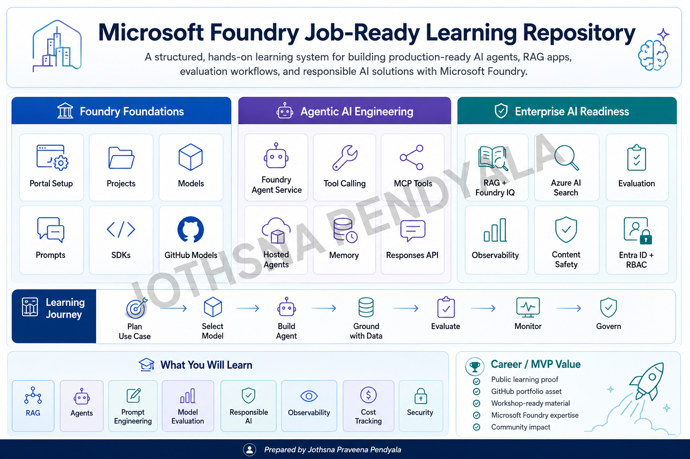

# Agentic AI on Azure — Foundry Learning Repository

A structured, hands-on learning repository built around Microsoft Foundry: the model catalog, agent runtime, knowledge grounding, tool ecosystem, and the control plane that governs and observes all of it.

This repository is built as a course-first, lab-driven learning system.
It is not a notes repository and not a demo collection.
Every session is designed to teach:

- what the topic is
- why it matters in real agentic systems
- how it fits into the Foundry platform as a whole
- how to practice it step by step
- how to validate and explain it confidently

## Scope

This repository stays entirely within Microsoft Foundry's native product surfaces:

- **Foundry Models** — model catalog, deployment types, Model Router
- **Foundry Agent Service** — hosted agents, multi-agent workflows, memory
- **Foundry IQ** — knowledge bases, permission-aware grounding
- **Foundry Tools** — connector catalog, custom tools via MCP
- **Azure Machine Learning** (native inside Foundry) — training, AutoML, MLOps
- **Foundry Local** — on-device and offline model execution
- **Foundry SDKs and VS Code Toolkit** — building from code and IDE
- **Foundry Control Plane** — fleet visibility, guardrails, Content Safety and trust controls, red-teaming
- **Observability** (within Control Plane) — tracing, evaluation, cost tracking

Topics outside this boundary (AKS scaling, Cosmos DB, Entra ID governance, Microsoft 365 / Teams / Copilot Studio integration, Agent 365, Work IQ, Fabric IQ) are intentionally out of scope for this repository, even where they'd naturally come up in a broader agentic AI course. These are "made accessible via Foundry" per Microsoft's own FAQ, or belong to a sibling product in the wider Microsoft IQ / M365 stack, not native to Foundry itself. Several also fall under different MVP Award Technology Areas entirely. Keeping the scope narrow is deliberate.

## Repository Design Philosophy

This repository follows four principles:

**1. Course-first structure**
Every folder is designed like a proper learning module, not just a technical dump.

**2. Hands-on workflow orientation**
Every session contains a practical lab flow that explains implementation, validation, troubleshooting, and cleanup.

**3. Real-world relevance**
Each topic is positioned in the context of how Foundry is actually used, not only theory.

**4. Step-by-step progression**
The repository starts with orientation and moves toward governed, observable, production-shaped agent systems — entirely on Foundry.

## Sessions

| Session | Topic | Foundry surface |
|---|---|---|
| 1 | Foundry Fundamentals — hubs, projects, RBAC | Orientation |
| 2 | Foundry Models I — catalog & comparison | Models |
| 3 | Foundry Models II — deployment types & Model Router | Models |
| 4 | Foundry Models III — fine-tuning | Models |
| 5 | Agent Service I — hosted agents basics | Agent Service |
| 6 | Agent Service II — Microsoft Agent Framework (open-source SDK) | Agent Service |
| 7 | Agent Service III — multi-agent orchestration | Agent Service |
| 8 | Agent Service IV — memory, conversations, Responses API | Agent Service |
| 9 | Foundry IQ I — knowledge bases & grounding | IQ |
| 10 | Foundry IQ II — permission-aware retrieval, ACLs | IQ |
| 11 | Foundry Tools I — prebuilt tool catalog | Tools |
| 12 | Foundry Tools II — custom tools via MCP | Tools |
| 13 | Azure ML in Foundry I — training & AutoML | Azure Machine Learning |
| 14 | Azure ML in Foundry II — model registry & MLOps | Azure Machine Learning |
| 15 | Foundry Local — on-device & edge | Local |
| 16 | Foundry SDKs — Python, C#, JS/TS, Java | SDKs |
| 17 | Foundry Toolkit for VS Code | SDKs / Toolkit |
| 18 | Control Plane I — fleet governance & guardrails | Control Plane |
| 19 | Control Plane II — Content Safety & trust controls | Control Plane |
| 20 | Observability I — tracing with OpenTelemetry | Observability |
| 21 | Observability II — evaluators & continuous evaluation | Observability |
| 22 | Capstone — end-to-end governed agent build | All surfaces, integrated |

This is the full, confirmed scope of native Microsoft Foundry as of mid-2026, split into finer sessions for depth. Sessions won't be added beyond this list unless Microsoft's own documentation confirms a new native surface — the goal is complete, granular coverage, not open-ended expansion.

## What Each Session Contains

Every session folder in this repository is designed to contain:

**README.md**
A course-facing session overview explaining what the topic is, why it matters, and what the learner will gain.

**knowledge-check.md**
A short self-check with a few questions and an answer key, to confirm understanding before moving to the next session.

**lab/**
A structured hands-on workflow containing:
- lab overview
- architecture flow
- prerequisites
- implementation steps
- validation checks
- troubleshooting
- cleanup
- proof-of-execution (commands, outputs, and evidence links)

This makes the repository easy to follow, consistent, and professional.

## Who This Repository Is For

This repository is designed for:

- engineers who want a structured path into Microsoft Foundry specifically
- learners who prefer workflow-based practical understanding
- practitioners evaluating Foundry's agent tooling against open-source stacks
- candidates who want strong project and interview explanation ability
- anyone who wants a high-quality, course-ready reference scoped to one platform

## How to Use This Repository

Recommended flow for every session:

1. Read the session README.md
2. Understand why the topic matters
3. Open the lab/README.md
4. Follow the lab in order
5. Validate outcomes using validation-checks.md
6. Use troubleshooting.md if needed
7. Complete cleanup before moving to the next session
8. Work through knowledge-check.md before starting the next session

## Expected Learning Outcome

By the end of this repository, the learner should be able to:

- explain the Foundry hub/project structure and where governance sits
- navigate the model catalog and choose between deployment types
- build and orchestrate agents using Foundry Agent Service
- ground agents in enterprise knowledge using Foundry IQ, with permission-aware retrieval
- extend agents with tools from the Foundry Tools catalog or custom MCP tools
- apply guardrails and red-teaming through the Foundry Control Plane
- trace, evaluate, and monitor agent behavior end to end
- present a complete, Foundry-native agentic AI platform story with confidence

## Evidence and Validation Standards

To strengthen real-world credibility and portfolio quality, each session should include a lab/proof-of-execution.md file with:

- exact steps or commands used
- key output snippets or status checks
- screenshots or links to execution evidence
- short notes on what was validated

This keeps the repository practical, reviewable, and suitable for interview or community demonstration.

## Repository Standards

To keep the repository clean and consistent:

- every session follows the same core structure
- file names remain consistent across folders
- explanations stay outcome-oriented
- labs remain practical and validation-driven
- later sessions connect tracing, evaluation, and governance into one coherent story
- scope stays inside Microsoft Foundry — no cross-category drift

## Final Goal

The final goal of this repository is not only learning.
It is to build a clear, practical, and project-ready understanding of Microsoft Foundry end to end — from navigating a project to running a governed, observable multi-agent system.

## License

MIT
